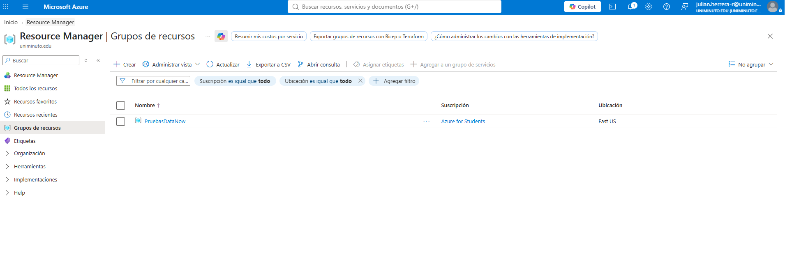
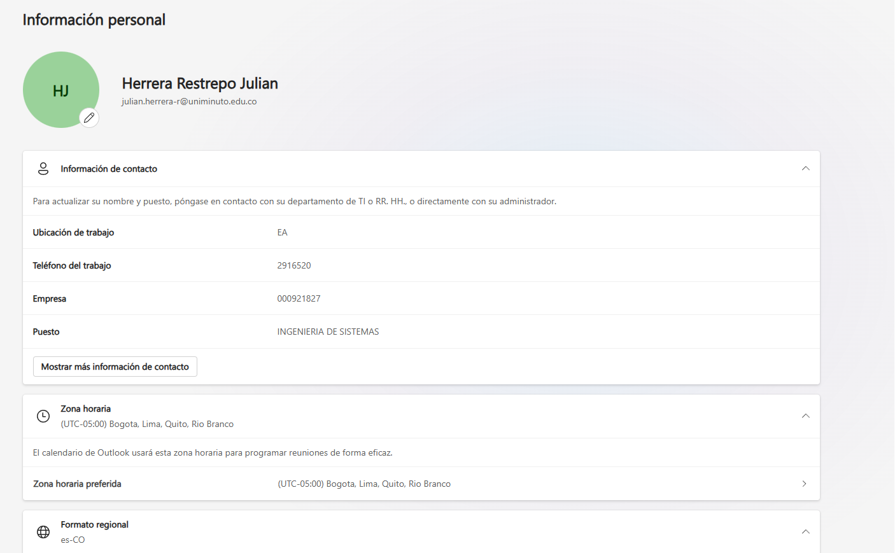
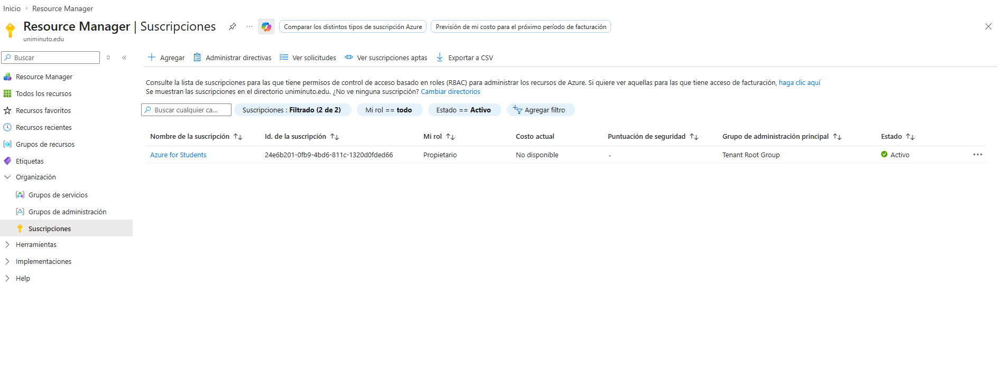
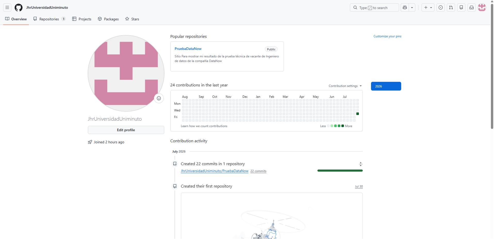
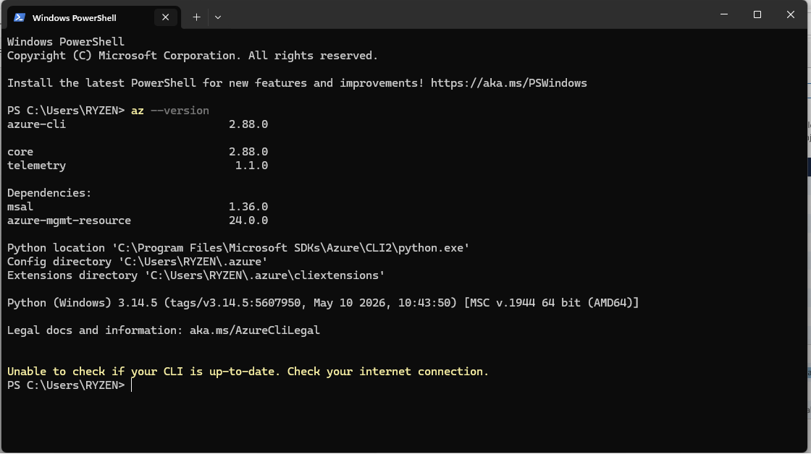
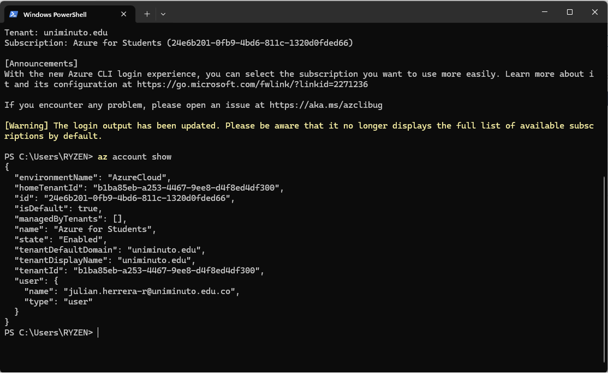
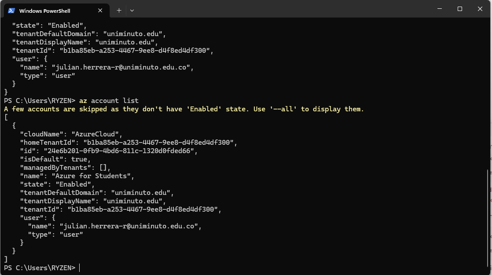
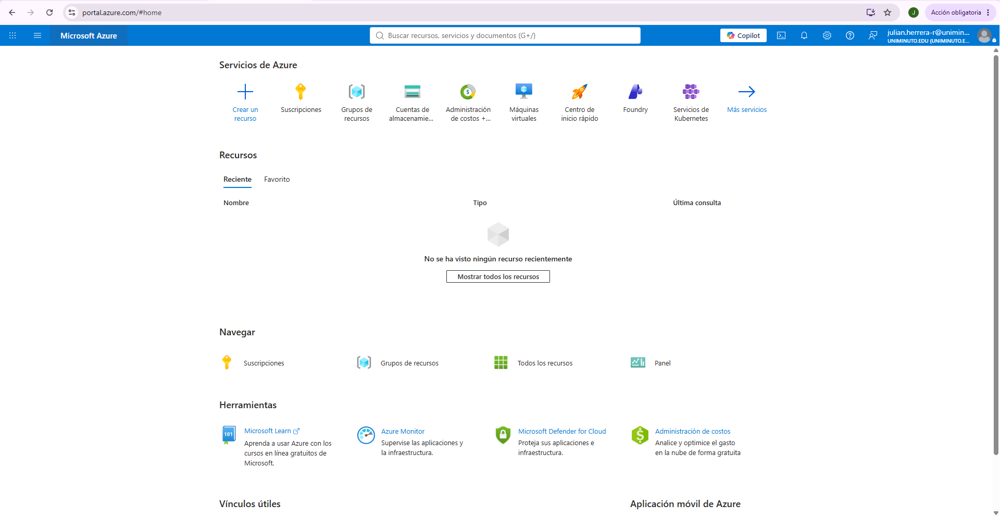

# 📋 Resultados y Evidencias - Prueba Técnica

## 📑 Contenido

- 📸 Evidencias Creación cuenta Cloud
- 📄 Documentación

---

📸 <strong>Ver evidencias</strong>

 

<table>
<tr>
<td width="50%">

### ☁️ Evidencia 1

**Creación de presupuestos en Microsoft Azure**

Se evidencia la cuenta creada en Azure.

</td>

<td width="50%" align="center">

</td>
</tr>
<tr>
<td width="50%">

### ☁️ Evidencia 2

**Crédito Gratuito**

Se evidencia la configuración del presupuesto realizada en Azure.

</td>

<td width="50%" align="center">

</td>
</tr>
<tr>
<td width="50%">

### ☁️ Evidencia 3

**Alerta de presupuesto configurada con limite de USD 10 y notificación por correo**

Se evidencia la configuración de alertas a presupuesto.

</td>

<td width="50%" align="center">

</td>
</tr>
<tr>
<td width="50%">

### ☁️ Evidencia 4

**método de pago verificado y funcional, incluso si el saldo disponible es mínimo**

Se evidencia los métodos de pago que están asociados.

</td>

<td width="50%" align="center">

</td>
</tr>
<tr>
<td width="50%">

### ☁️ Evidencia 5

**autenticación de doble factor activada en la cuenta cloud para protección de la cuenta**

Se evidencia inicio sección con doble factor.
</td>

<td width="50%" align="center">

</td>
</tr>
<tr>
<td width="50%">

### ☁️ Evidencia 6

**Region de trabajo seleccionada: East US para Azure y AWS, us-central1 para GCP**

Se evidencia región donde esta creados los recursos.
</td>

<td width="50%" align="center">

</td>
</tr>
<tr>
<td width="50%">

### ☁️ Evidencia 7

**Correo electrónico y numero de teléfono verificados en el portal de la plataforma**

Se evidencia el correo electrónico verificado.
</td>

<td width="50%" align="center">

</td>
</tr>

<tr>
<td width="50%">

### ☁️ Evidencia 8

**Beneficios de correo estudiantil activados si el candidato dispone de correo institucional**

Se evidencia los beneficios de la cuenta estudiantil.
</td>

<td width="50%" align="center">

</td>
</tr>
<tr>
<td width="50%">

### ☁️ Evidencia 9

**Repositorio Git creado en GitHub, GitLab o Bitbucket con acceso compartido al evaluador**

Se evidencia repositorio Git Creado.
</td>

<td width="50%" align="center">

</td>
</tr>
<tr>
<td width="50%">

### ☁️ Evidencia 10

**Herramienta de IaC instalada localmente: Terraform, Bicep, AWS CLI o gcloud CLI según la plataforma**

Se evidencia localmente instalado el Azure Cli.
</td>

<td width="50%" align="center">

</td>
</tr>
<tr>
<td width="50%">

### ☁️ Evidencia 11

**CLI de la plataforma cloud instalado y autenticado correctamente en el equipo local**

Se evidencia localmente ejecutándose el Azure Cli.
</td>

<td width="50%" align="center">

</td>
</tr>
<tr>
<td width="50%">

### ☁️ Evidencia 12

**Acceso probado a la consola o portal de la plataforma desde el navegador y desde el terminal**

Se evidencia localmente ejecutándose el Azure Cli y el portal web de Azure.
</td>

<td width="50%" align="center">
<tr>

</tr>
<tr>

</tr>  
</td>
</tr>
</table>

---

📄 <strong>Ver documentación</strong>

 

Aquí puedes agregar:

- Explicación del procedimiento.
- Enlaces a documentos PDF.
- Capturas adicionales.
- Código utilizado.
- Referencias.

