# 📋 Resultados y Evidencias - Prueba Técnica

## 📑 Contenido

- 📸 Evidencias Creación cuenta Cloud
- 📄 Documentación

---

📸 <strong>Ver evidencias</strong>

 

<table>
<tr>
<td width="50%">

### ☁️ Evidencia 1

**Creación de presupuestos en Microsoft Azure**

Se evidencia la cuenta creada en Azure.

</td>

<td width="50%" align="center">

</td>
</tr>
<tr>
<td width="50%">

### ☁️ Evidencia 2

**Crédito Gratuito**

Se evidencia la configuración del presupuesto realizada en Azure.

</td>

<td width="50%" align="center">

</td>
</tr>
<tr>
<td width="50%">

### ☁️ Evidencia 3

**Alerta de presupuesto configurada con limite de USD 10 y notificación por correo**

Se evidencia la configuración de alertas a presupuesto.

</td>

<td width="50%" align="center">

</td>
</tr>
<tr>
<td width="50%">

### ☁️ Evidencia 4

**método de pago verificado y funcional, incluso si el saldo disponible es mínimo**

Se evidencia los métodos de pago que están asociados.

</td>

<td width="50%" align="center">

</td>
</tr>
<tr>
<td width="50%">

### ☁️ Evidencia 5

**autenticación de doble factor activada en la cuenta cloud para protección de la cuenta**

Se evidencia inicio sección con doble factor.
</td>

<td width="50%" align="center">

</td>
</tr>
<tr>
<td width="50%">

### ☁️ Evidencia 6

**Region de trabajo seleccionada: East US para Azure y AWS, us-central1 para GCP**

Se evidencia región donde esta creados los recursos.
</td>

<td width="50%" align="center">

</td>
</tr>
<tr>
<td width="50%">

### ☁️ Evidencia 7

**Correo electrónico y numero de teléfono verificados en el portal de la plataforma**

Se evidencia el correo electrónico verificado.
</td>

<td width="50%" align="center">

</td>
</tr>

<tr>
<td width="50%">

### ☁️ Evidencia 8

**Beneficios de correo estudiantil activados si el candidato dispone de correo institucional**

Se evidencia los beneficios de la cuenta estudiantil.
</td>

<td width="50%" align="center">

</td>
</tr>
<tr>
<td width="50%">

### ☁️ Evidencia 9

**Repositorio Git creado en GitHub, GitLab o Bitbucket con acceso compartido al evaluador**

Se evidencia repositorio Git Creado.
</td>

<td width="50%" align="center">

</td>
</tr>
<tr>
<td width="50%">

### ☁️ Evidencia 10

**Herramienta de IaC instalada localmente: Terraform, Bicep, AWS CLI o gcloud CLI según la plataforma**

Se evidencia localmente instalado el Azure Cli.
</td>

<td width="50%" align="center">

</td>
</tr>
<tr>
<td width="50%">

### ☁️ Evidencia 11

**CLI de la plataforma cloud instalado y autenticado correctamente en el equipo local**

Se evidencia localmente ejecutándose el Azure Cli.
</td>

<td width="50%" align="center">

</td>
</tr>
<tr>
<td width="50%">

### ☁️ Evidencia 12

**Acceso probado a la consola o portal de la plataforma desde el navegador y desde el terminal**

Se evidencia localmente ejecutándose el Azure Cli y el portal web de Azure.
</td>

<td width="50%" align="center">

 

</td>
</tr>
</table>

---

📄 <strong>Ver documentación</strong>

 

<h1>🚚 DOCUMENTACIÓN TÉCNICA Y ENTREGABLE FINAL</h1>

<strong>Empresa:</strong> LogiTrack S.A.S. (Logística y Cadena de Suministro)

<strong>Plataforma Cloud:</strong> Microsoft Azure

<strong>Arquitectura:</strong> Medallón (Bronze, Silver, Gold) sobre Azure Data Lake Storage Gen2 (ADLS Gen2)

<h2>💡 1. Justificación del Escenario y Plataforma</h2>
<ul>
    <li><strong>Sector Seleccionado:</strong> Escenario D - Logística y Cadena de Suministro (LogiTrack S.A.S.).
        <ul>
            <li><em>Justificación:</em> Permite resolver la problemática de la alta tasa de entregas fallidas (14.3%) mediante la consolidación de más de 2 millones de envíos y datos de telemetría GPS. Permite calcular un <em>Score de Desempeño Multidimensional</em> justo para conductores y detectar alertas de retrasos en zonas críticas.</li>
        </ul>
    </li>
    <li><strong>Plataforma Cloud:</strong> Microsoft Azure.
        <ul>
            <li><em>Justificación:</em> Proporciona una suite nativa para soluciones de Big Data y analítica enterprise mediante ADLS Gen2, Azure Data Factory y Azure Key Vault para la protección de secretos.</li>
        </ul>
    </li>
</ul>

<h2>🏗️ 2. Entregable Fase 1: ENTREGABLE FASE 1 — GENERACION DE DATOS Y MODELO RELACIONAL</h2>

<h3>2.1 Script de generación de datos dummy</h3>

El código fuente de la generación de datos sintéticos se encuentra en el siguiente repositorio:

<ul>
  <li>
    <strong>Pipeline principal:</strong>
    <a href="https://github.com/JhrUniversidadUniminuto/PruebaDataNow/blob/main/main.py">main.py</a>
  </li>
  <li>
    <strong>Orquestación:</strong>
    <a href="https://github.com/JhrUniversidadUniminuto/PruebaDataNow/blob/main/pipeline.py">pipeline.py</a>
  </li>
  <li>
    <strong>Configuración (semilla aleatoria y parámetros):</strong>
    <a href="https://github.com/JhrUniversidadUniminuto/PruebaDataNow/blob/main/config/parametros.py">config/parametros.py</a>
  </li>
  <li>
    <strong>Generadores de datos:</strong>
    <a href="https://github.com/JhrUniversidadUniminuto/PruebaDataNow/tree/main/generators">Carpeta generators</a>
  </li>
   
   
  <li>
    <strong>Evidencia Desencadenador datos sintéticos por perspectiva:</strong>
    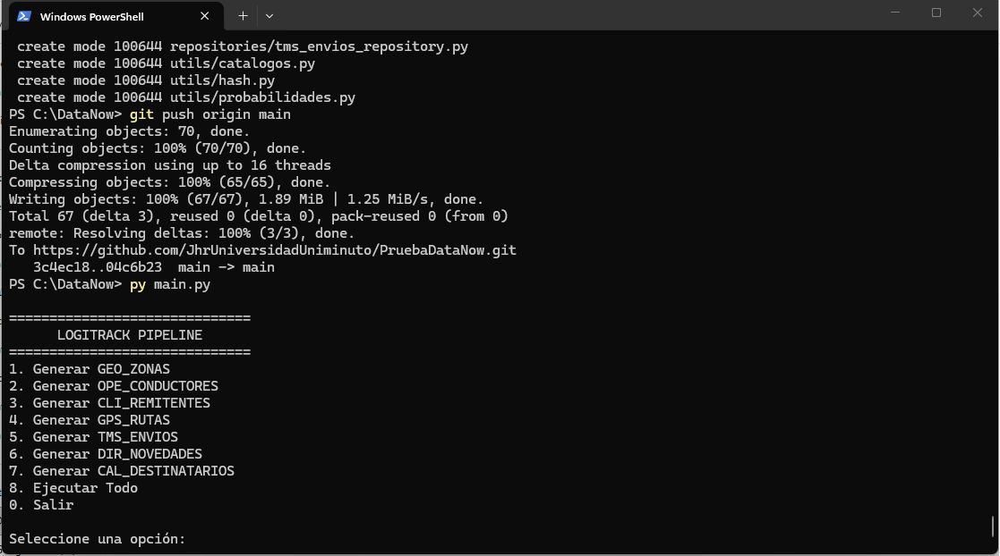
  </li>
    
</ul>

<h3>2.2 Script SQL o Python de carga en la base de datos relacional seleccionada</h3>
  <li>
    <strong>Script creacion de modelo de datos transaccional:</strong>
    <a href="https://github.com/JhrUniversidadUniminuto/PruebaDataNow/tree/main/CreacionModeloTrascionalAzure.txt">Script</a>
  </li>

<h3>2.3 Diagrama Entidad-Relación (ER) de todas las tablas generadas, ubicado en la carpeta /docs del repositorio</h3>
  <li>
    <strong>Diagrama</strong>
    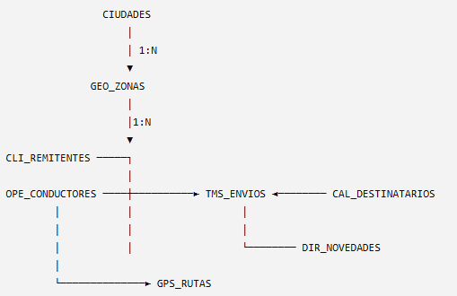
  </li>
<h3>2.4 Evidencia de la carga exitosa: captura de pantalla o resultado de SELECT COUNT(*) por tabla</h3>
  <li>
    <strong>OPE_CONDUCTORES</strong>
    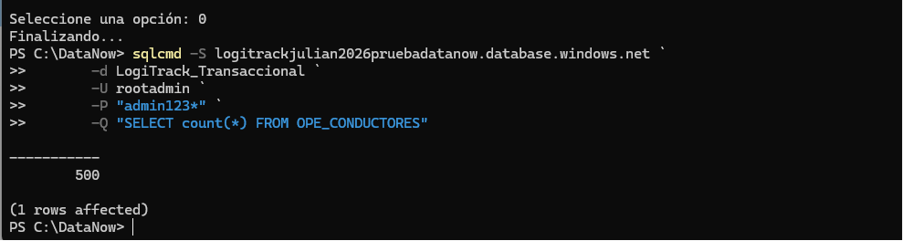
  </li>
  <li>
    <strong>Ciudades</strong>
    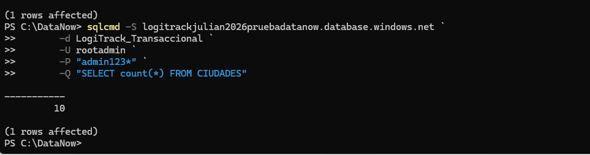
  </li>
  <li>
    <strong>GeoZonas</strong>
    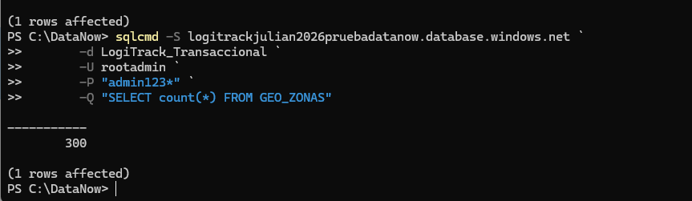
  </li>
  <li>
    <strong>Remitentes</strong>
    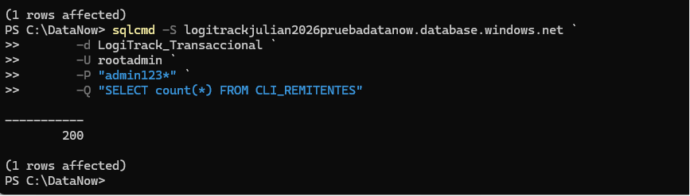
  </li>
  <li>
    <strong>Gps Rutas</strong>
    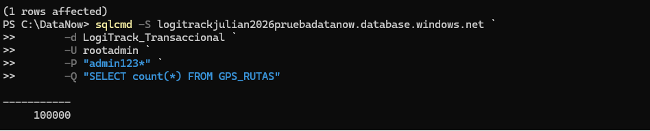
  </li>
  <li>
    <strong>Tms Envios</strong>
    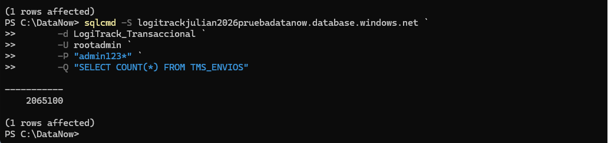
  </li>
  <li>
    <strong>Novedades</strong>
    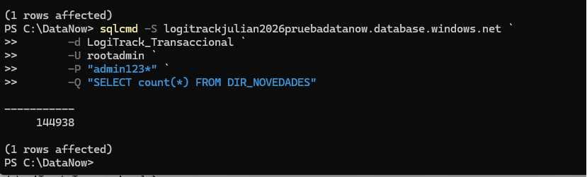
  </li>
  <li>
    <strong>Destinatarios</strong>
    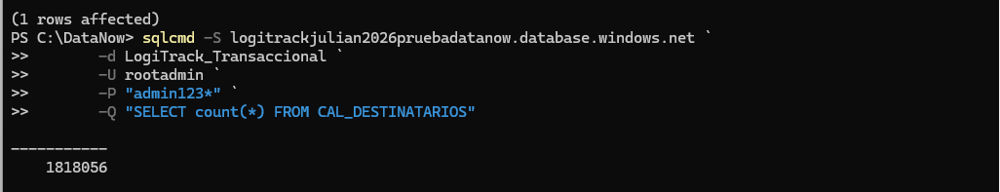
  </li>

<h2>🏗️ 3. ENTREGABLE FASE 2 — INFRAESTRUCTURA COMO CODIGO</h2>
<h3>3.1 Código IaC completo en la carpeta /infra del repositorio, con README de instrucciones de despliegue</h3>

README:

<ul>
  <li>
    <strong>Configuiración:</strong>
    <a href="https://github.com/JhrUniversidadUniminuto/PruebaDataNow/blob/main/03CREACIONMODELObroncesilvergold.txt">Leerme</a>
  </li>
    
</ul>
<h3>3.2 Evidencia del despliegue exitoso: captura de pantalla del portal o salida del terminal con el resultado del apply</h3>

Imagen evidencia:

<ul>
  <li>
    <strong>Evidencia:</strong>
    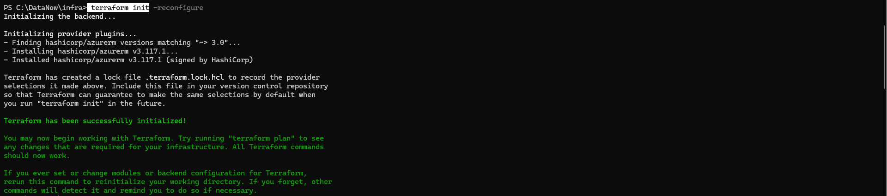
    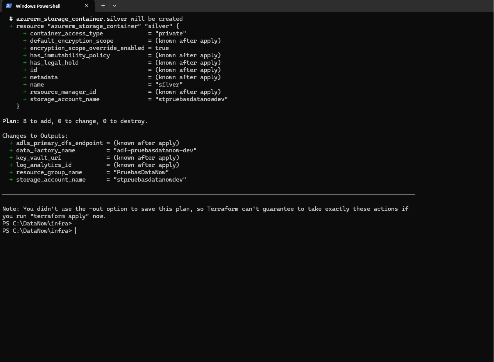
  </li>
    
</ul>
<h3>3.3 Lista de recursos creados con sus nombres, regiones y propósito dentro de la solución</h3>

La siguiente tabla resume los recursos desplegados en Microsoft Azure mediante Infraestructura como Código (IaC). Se indica el nombre de cada recurso, su tipo, la región donde fue aprovisionado y el papel que desempeña dentro de la arquitectura implementada.

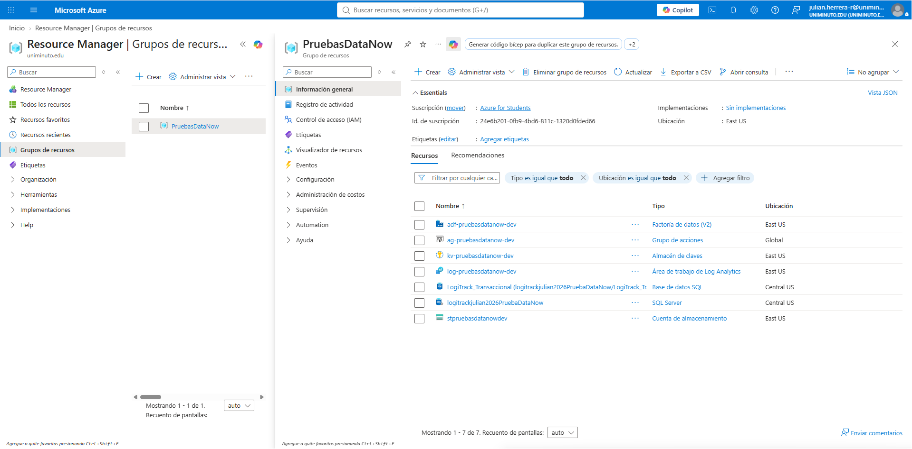

 

| Recurso | Tipo | Región | Propósito dentro de la solución |
|----------|------|--------|---------------------------------|
| **PruebasDataNow** | Resource Group | East US | Contenedor lógico que agrupa todos los recursos de Azure utilizados por la solución para facilitar su administración, monitoreo y eliminación. |
| **stpruebasdatanowdev** | Storage Account (ADLS Gen2) | East US | Repositorio principal del Data Lake donde se almacenan las capas Bronze, Silver y Gold con archivos Parquet generados por el pipeline. |
| **adf-pruebasdatanow-dev** | Azure Data Factory V2 | East US | Orquesta la ejecución de los procesos ETL/ELT, coordinando la ingestión y transformación de datos. |
| **kv-pruebasdatanow-dev** | Azure Key Vault | East US | Almacena de forma segura secretos, credenciales y cadenas de conexión utilizadas por los diferentes servicios. |
| **log-pruebasdatanow-dev** | Log Analytics Workspace | East US | Centraliza registros, métricas y diagnósticos para facilitar el monitoreo y la solución de incidentes. |
| **ag-pruebasdatanow-dev** | Action Group | Global | Gestiona el envío de alertas y notificaciones cuando se presentan eventos críticos o fallos en la solución. |
| **logitrackjulian2026PruebaDataNow** | Azure SQL Server | Central US | Servidor lógico que hospeda la base de datos transaccional utilizada como origen de información. |
| **LogiTrack_Transaccional** | Azure SQL Database | Central US | Base de datos OLTP donde se almacenan conductores, envíos, rutas GPS, remitentes, novedades, zonas y demás información operacional. |
 
 
<h3>3.4 Archivo de variables o parámetros separado del código principal, sin credenciales expuestas</h3>

Nótese que el archivo "conexiones.py", tiene las cadenas de conexión usando mascaras de los parámetros, estos parámetros están en el archivo "parametros.py", el cual es llamado en conexiones.

<ul>
  <li>
    <strong>conexion.py:</strong>
    <a href="https://github.com/JhrUniversidadUniminuto/PruebaDataNow/blob/main/config/conexion.py">Ver</a>
  </li>
  <li>
    <strong>parametros.py:</strong>
    <a href="https://github.com/JhrUniversidadUniminuto/PruebaDataNow/blob/main/config/parametros.py">Ver</a>
  </li>  
</ul>

<h2>🏅 4. ENTREGABLE FASE 3 - PIPELINE END TO END FLUJO DE DATOS: ARQUITECTURA MEDALLION</h2>

<h3>4.1 Código completo de las tres capas del pipeline en la carpeta /pipelines del repositorio</h3>

Esta es la carpeta /pipelines dispuesta para la solución.

<ul>
  <li>
    <strong>/pipelines:</strong>
    <a href="https://github.com/JhrUniversidadUniminuto/PruebaDataNow/blob/main/infra/pipelines">Ver</a>
  </li>
  <li>
    <strong>parametros.py:</strong>
    <a href="https://github.com/JhrUniversidadUniminuto/PruebaDataNow/blob/main/config/parametros.py">Ver</a>
  </li>  
</ul>
<h3>4.2 Reporte de calidad de datos generado por la capa Silver con métricas de al menos una ejecución</h3>

Este fue el mensaje que se obtiene de la capa silver.

<ul>
  <li>
    <strong>Resultado:</strong>
    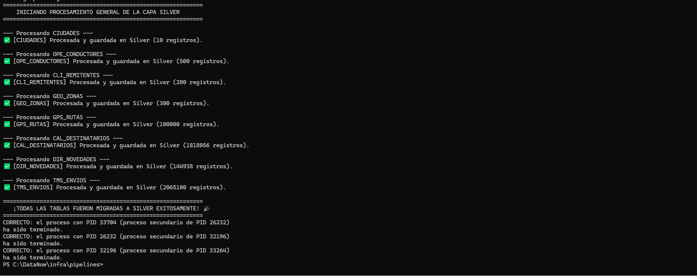
  </li>
</ul>
<h3>4.3 Al menos tres tablas o vistas de agregación en la capa Gold con sus definiciones documentadas</h3>

Este fue el mensaje que se obtiene de la capa gold

<ul>
  <li>
    <strong>Resultado:</strong>
    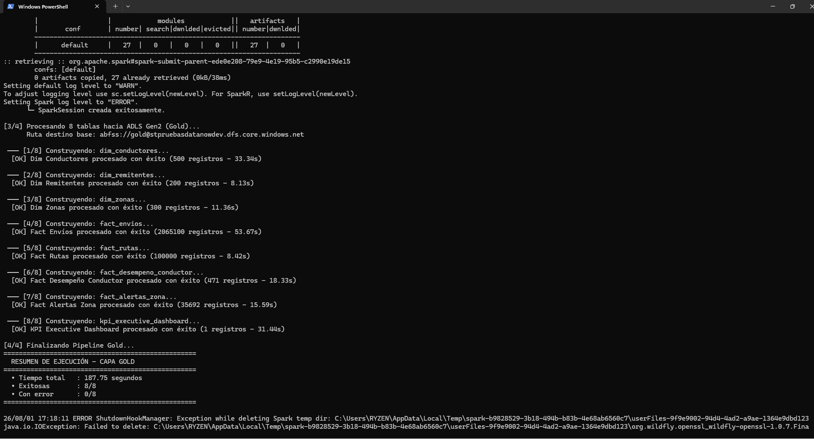
  </li>
</ul>
<h3>4.4 Resultados de las cinco pruebas de calidad de datos con el reporte de aprobación o fallo </h3>

Este fue el mensaje que se obtiene de la pruebas

<ul>
  <li>
    <strong>Resultado:</strong>
    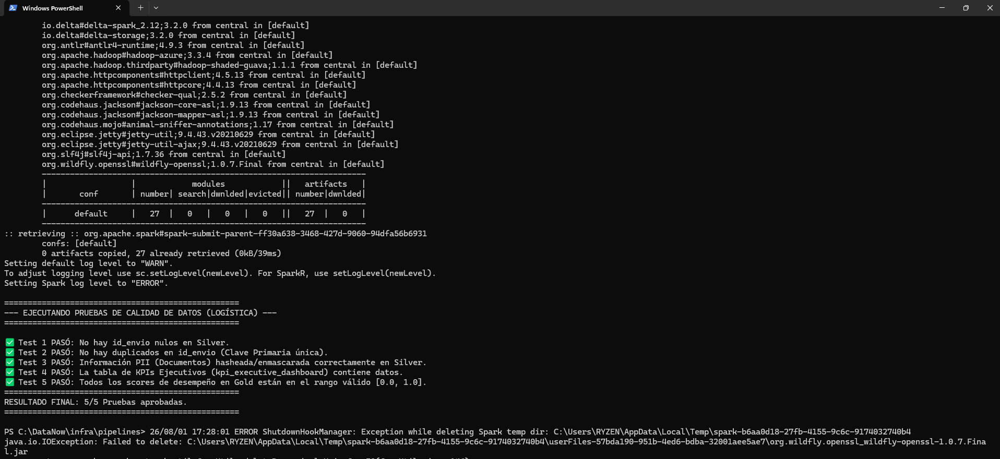
  </li>
</ul>

<h2>⚙️ 5. ENTREGABLE FASE 4 — ORQUESTACION DEL PIPELINE </h2>
<h3>5.1 Definición del DAG o pipeline principal en la carpeta /orchestration del repositorio</h3>

Se realiza la orquestación del proceso por medio de un menú de opciones.

<ul>
  <li>
    <strong>opciones:</strong>
      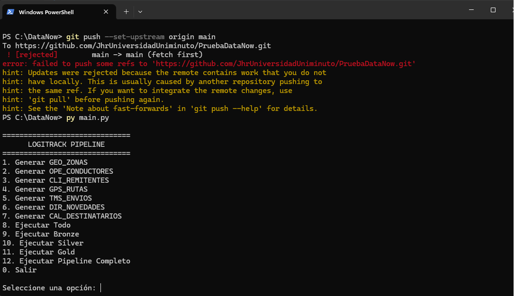
  </li>

</ul>
<h3>5.2 Captura de pantalla del DAG ejecutado exitosamente con el estado de cada tarea visible </h3>

Mensaje de exito.

<ul>
  <li>
    <strong>opciones:</strong>
      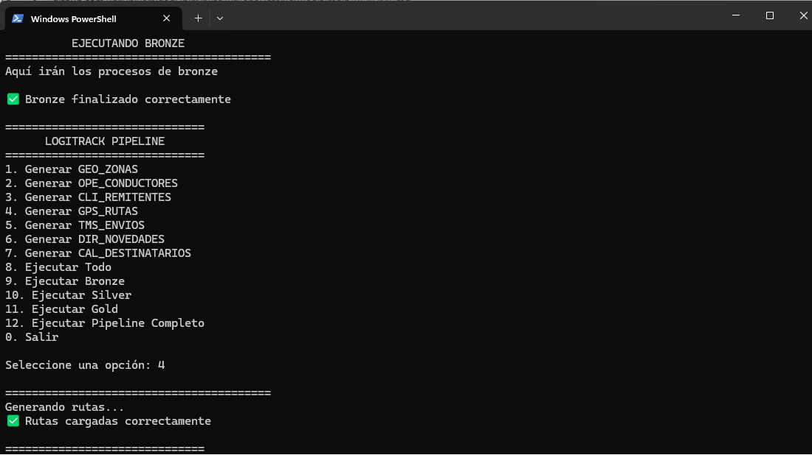
  </li>
</ul>
<h3>5.3 Evidencia de la alerta de fallo: captura del correo o mensaje recibido ante una ejecución fallida de prueba </h3>

Mensaje de error en caso de fallo.

<ul>
  <li>
    <strong>opciones:</strong>
      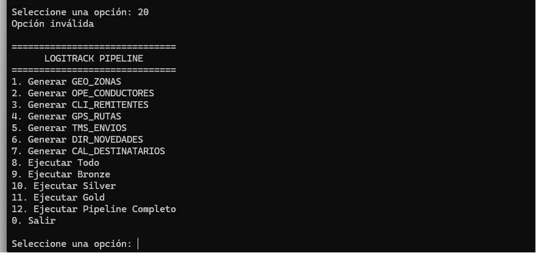
  </li>
</ul>

<h2>🔐 6. ENTREGABLE FASE 4 — ORQUESTACION DEL PIPELINE </h2>

<h3>6.1 Matriz de Roles y Accesos (RBAC)</h3>
<table border="1" cellspacing="0" cellpadding="5">
    <thead>
        <tr>
            <th>Rol</th>
            <th>Permisos en Azure IAM / AD</th>
            <th>Capa Bronze</th>
            <th>Capa Silver</th>
            <th>Capa Gold</th>
        </tr>
    </thead>
    <tbody>
        <tr>
            <td><strong>Data Engineer</strong></td>
            <td>Contributor + Storage Blob Data Contributor</td>
            <td>Lectura / Escritura</td>
            <td>Lectura / Escritura</td>
            <td>Lectura / Escritura</td>
        </tr>
        <tr>
            <td><strong>Data Analyst</strong></td>
            <td>Reader + Storage Blob Data Reader (Solo Gold)</td>
            <td>❌ Acceso Denegado</td>
            <td>❌ Acceso Denegado</td>
            <td>Lectura (Datos Anonimizados)</td>
        </tr>
        <tr>
            <td><strong>Administrator</strong></td>
            <td>Owner / User Access Administrator</td>
            <td>Control Total</td>
            <td>Control Total</td>
            <td>Control Total</td>
        </tr>
    </tbody>
</table>

<h3>6.2 Catálogo de Datos Básico</h3>

<h4>Tabla: <code>dim_conductores</code> (Capa Gold)</h4>
<table border="1" cellspacing="0" cellpadding="5">
    <thead>
        <tr>
            <th>Campo</th>
            <th>Tipo</th>
            <th>Origen</th>
            <th>Sensible (PII)</th>
            <th>Descripción</th>
        </tr>
    </thead>
    <tbody>
        <tr>
            <td><code>cond_id</code></td>
            <td><code>INT</code></td>
            <td><code>OPE_CONDUCTORES</code></td>
            <td>No</td>
            <td>Identificador único del conductor.</td>
        </tr>
        <tr>
            <td><code>num_doc_hash</code></td>
            <td><code>STRING</code></td>
            <td><code>OPE_CONDUCTORES</code></td>
            <td><strong>Sí (Enmascarado)</strong></td>
            <td>Hash SHA-256 del número de documento original[cite: 1].</td>
        </tr>
        <tr>
            <td><code>tip_vehiculo</code></td>
            <td><code>STRING</code></td>
            <td><code>OPE_CONDUCTORES</code></td>
            <td>No</td>
            <td>Categoría estandarizada (Moto, Bicicleta, Van, Camión)[cite: 1].</td>
        </tr>
        <tr>
            <td><code>antiguedad_anos</code></td>
            <td><code>FLOAT</code></td>
            <td>Calculado</td>
            <td>No</td>
            <td>Antigüedad en años calculada a partir de <code>fec_ingreso</code>[cite: 1].</td>
        </tr>
    </tbody>
</table>

<h4>Tabla: <code>fact_desempeno_conductor</code> (Capa Gold)</h4>
<table border="1" cellspacing="0" cellpadding="5">
    <thead>
        <tr>
            <th>Campo</th>
            <th>Tipo</th>
            <th>Origen</th>
            <th>Sensible (PII)</th>
            <th>Descripción</th>
        </tr>
    </thead>
    <tbody>
        <tr>
            <td><code>cond_id</code></td>
            <td><code>INT</code></td>
            <td><code>OPE_CONDUCTORES</code></td>
            <td>No</td>
            <td>Identificador del conductor.</td>
        </tr>
        <tr>
            <td><code>fec_evaluacion</code></td>
            <td><code>DATE</code></td>
            <td><code>TMS_ENVIOS</code> / <code>GPS_RUTAS</code></td>
            <td>No</td>
            <td>Fecha de consolidación del desempeño.</td>
        </tr>
        <tr>
            <td><code>score_desempeno</code></td>
            <td><code>FLOAT</code></td>
            <td>Calculado</td>
            <td>No</td>
            <td>Score multidimensional ponderado (rango 0.0 - 1.0)[cite: 1].</td>
        </tr>
    </tbody>
</table>

