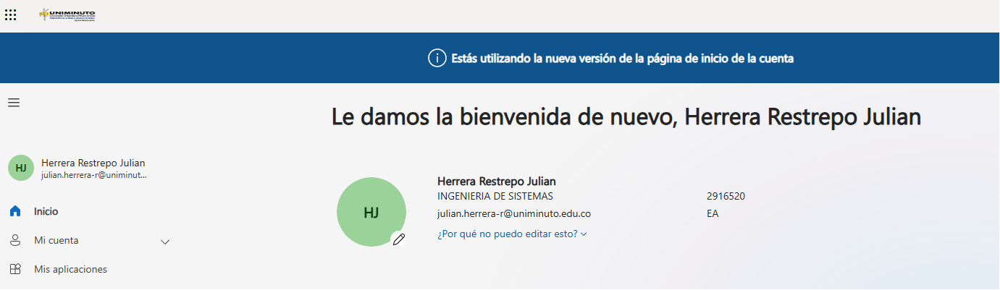
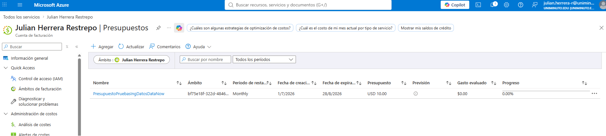
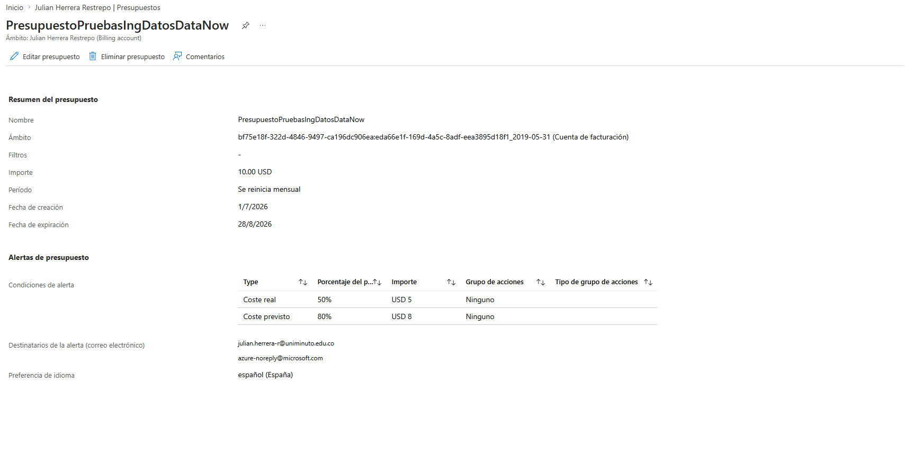
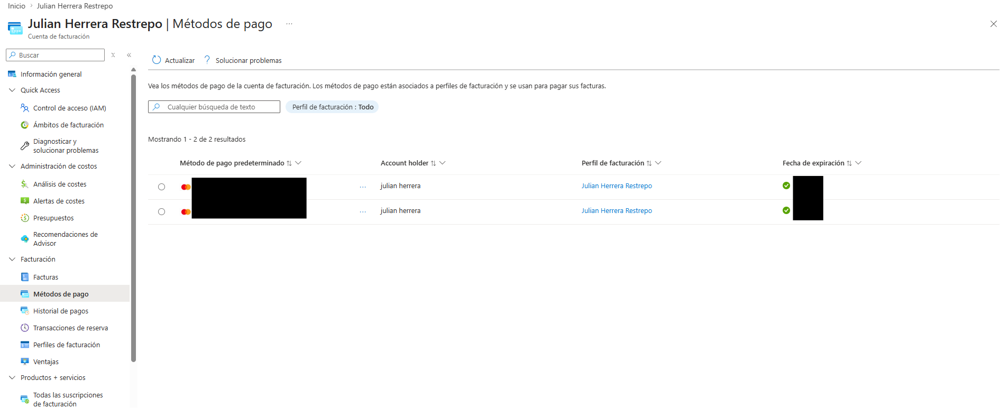
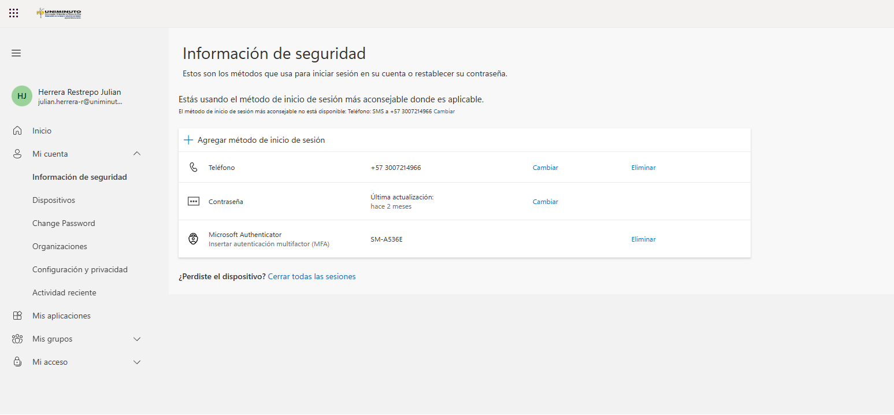

# 📋 Resultados y Evidencias - Prueba Técnica

## 📑 Contenido

- 📸 Evidencias Creación cuenta Cloud
- 📄 Documentación

---

📸 <strong>Ver evidencias</strong>

 

<table>
<tr>
<td width="50%">

### ☁️ Evidencia 1

**Creación de presupuestos en Microsoft Azure**

Se evidencia la cuenta creada en Azure.

</td>

<td width="50%" align="center">

</td>
</tr>
<tr>
<td width="50%">

### ☁️ Evidencia 2

**Crédito Gratuito**

Se evidencia la configuración del presupuesto realizada en Azure.

</td>

<td width="50%" align="center">

</td>
</tr>
<tr>
<td width="50%">

### ☁️ Evidencia 3

**Alerta de presupuesto configurada con limite de USD 10 y notificación por correo**

Se evidencia la configuración de alertas a presupuesto.

</td>

<td width="50%" align="center">

</td>
</tr>
<tr>
<td width="50%">

### ☁️ Evidencia 4

**método de pago verificado y funcional, incluso si el saldo disponible es mínimo**

Se evidencia los métodos de pago que están asociados.

</td>

<td width="50%" align="center">

</td>
</tr>
</tr>
<tr>
<td width="50%">

### ☁️ Evidencia 5

**autenticación de doble factor activada en la cuenta cloud para protección de la cuenta**

Se evidencia inicio sección con doble factor.
</td>

<td width="50%" align="center">

</td>
</tr>
</table>

---

📄 <strong>Ver documentación</strong>

 

Aquí puedes agregar:

- Explicación del procedimiento.
- Enlaces a documentos PDF.
- Capturas adicionales.
- Código utilizado.
- Referencias.

